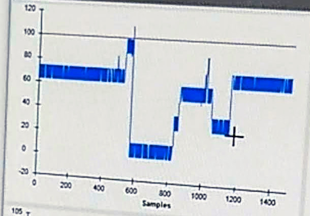

# Experimenter Instructions and Troubleshooting

## Notes on Bonsai Workflow

- Starting/Stopping Cameras
	- start: shift + F1	
	- stop: shift + F2
- Starting Postion Tracking
	- click on overhead camera gui and move hand around, above the arena (clicking on the plot toggles the tracking visualization between 3 modes: 1.  plotting the dot of the tracked object, 2. plotting the entire history trajectory of the tracked object, 3. plotting the history trajectory of the tracked object until the object stops moving for a window greater than the time of the current trajectory)
  2. plot the dot + trajectory (infinite)
  3. plot the dot + trajectory (finite w/ rolling window equal to current trajectory
- Hotkey triggering of pellets
	- patch 1: shift + F3
	- patch 2: shift + F4

- Things to pay attention in GUI:

	
		
	- Things to try if a beambreak signal is not seen after a pellet is triggered:	
		- Things to try if the FED3 is not delivering pellets when triggered:
			 - Clear any debris in the FED3 aperture.
			 - Clear any debris in the hole that feeds from the FED3 hopper to the FED3 aperture (underneath the disk).
			 - Clear any debris lodged underneath the disk.
			 - Ensure the disk fits snugly in the hopper and can be manually rotated.
			 - Clear any debris in the chute from the FED3 aperture to the wheel.
		- Things to try if the FED3 is delivering pellets when triggered:
			- Clear any debris from the FED3 aperture that may be breaking the beambreak (even though this debris is not stopping pellet delivery).
			- Restart the workflow and/or Bonsai.
	
	

	- Things to try if there is noise and/or fluctuations in the wheel's magnetic encoder values:
		- Underneath the wheel, check that the magnet and the encoder PCB are in alignment.
		- Check that all wiring between the FED3, encoder PCB, and HARP device is properly connected.

- Notes on Errors:
	- Out-of-memory error
	- Tracking error (tracking queue empty)
	- Com port access denied error: Bonsai is not able to access a COM port on the acquisition computer that a hardware device is connected to.
		- Causes:
			- Some other process in Windows gains access to that COM port.
			- The Bonsai workflow is started too quickly after Bonsai is started (this would mean the COM ports did not initialize properly in Bonsai).
		- Fixes:
			- Restart Bonsai.
			- Restart the computer.

## Starting a Session (Placing a mouse in the arena)

1. Ensure cameras are on, well-positioned, zoomed, and focused.
2. Replenish pellets in fed3 hoppers (there should be about 200-400 in each hopper).
3. Manually trigger each patch multiple times to ensure pellets are being delivered properly. If they are not, follow the troubleshooting instructions above (under "Things to try if the FED3 is not delivering pellets when triggered").
4. Ensure parameter values in Bonsai workflow are properly set.
5. Take some bedding from the animal's cage and place it in the arena nesting box.
6. Place water in the arena.
7. Weigh the animal.
8. Place the animal in the arena nesting box.
9. Place a blocker in front of the animal to keep it in the arena nesting box. 
10. In Bonsai, record the animal's ID and weight, and start the session.
11. Remove the blocker in front of the animal so that it can travel into the corridor and arena.

## Ending a Session (Removing a mouse from the arena)

1. In Bonsai, stop the session.
2. Remove the animal from the arena, weigh it, and place it back in its homecage.
3. In Bonsai, record the animal's weight and end the session.
4. Record the number of missed pellets (that fell through the wheel to the petry dish below the arena) for each patch for the session.
5. Clean the arena nesting box, corridor, and arena (particularly the food patch tiles) with 70% ethanol.

## General Maintenance

- Clean the FED3 hopper, disk, and the chutes from the FED3 apertures to the wheels, weekly.
- Measure and record wheels' start torques, weekly.
- Replace 3d printed parts as necessary.

## Notes on Hardware Configuration

## Random Other Notes

- Fed3 beambreak is much more likely to be broken if something slows down the pellet on the way out from the Fed3 aperture.